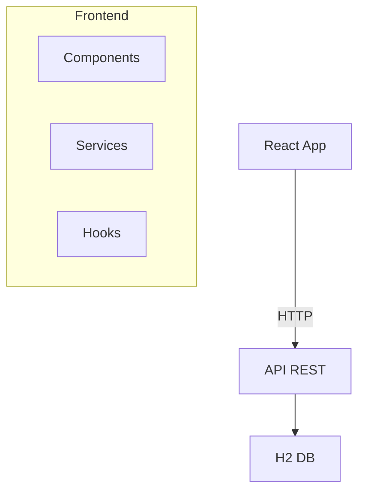

# Design

## Visão Geral

SPA React mobile-first para CRUD de pessoas via API REST. Interface moderna e responsiva.

## Arquitetura



### Stack Tecnológico

- **Frontend**: React 18 + Vite
- **Estilo**: Bootstrap 5 + CSS customizado
- **HTTP**: Axios
- **Roteamento**: React Router
- **Estado**: React Hooks

## Componentes

### Hierarquia
```
App
├── Layout (Header/Footer)
├── Pages (List/Add/Edit/Health)
└── Shared (PersonCard/PersonForm/Loading/Error)
```

### Componentes Principais

#### PersonCard
- Avatar por gênero
- Nome, email, data nascimento
- Botões editar/excluir

#### PersonForm
- Campos: nome, email, telefone, gênero, data
- Validação em tempo real
- Botões salvar/cancelar

### API Service
```javascript
class PessoaService {
  static async listarPessoas()
  static async buscarPessoa(id)
  static async criarPessoa(pessoa)
  static async atualizarPessoa(id, pessoa)
  static async removerPessoa(id)
  static async verificarHealth()
}
```

## Modelos de Dados

```typescript
interface Pessoa {
  id?: number;
  nome: string;
  email: string;
  telefone?: string; // (XX) XXXXX-XXXX
  genero: 'Masculino' | 'Feminino' | 'Não Informado';
  dataNascimento: string; // YYYY-MM-DD
}
```

## Tratamento de Erros

### Estratégia
- Erros de rede: "Erro de conexão"
- Erros de validação: Mensagens específicas por campo
- Erros da API: Exibir mensagem retornada
- Toast notifications para feedback

## Estratégia de Testes

### Ferramentas
- **Jest**: Framework de testes
- **React Testing Library**: Testes de componentes
- **MSW**: Mock da API

### Cobertura
- Componentes: Renderização e interações
- Services: Chamadas à API
- Hooks: Lógica de estado