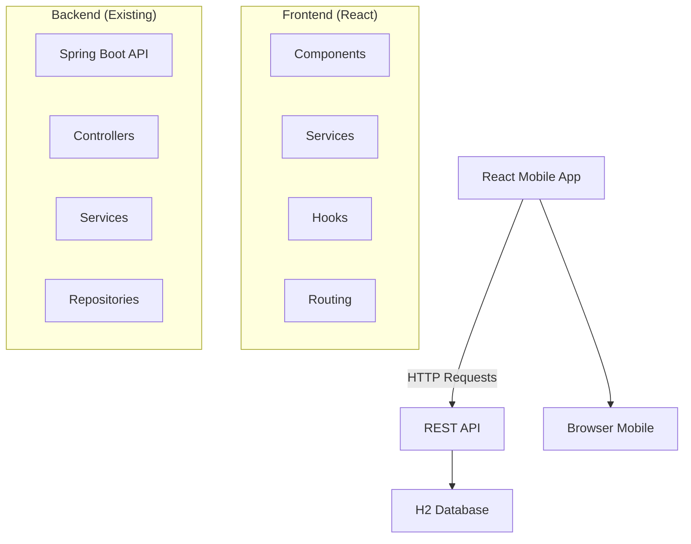

# Design Document

## Overview

O projeto consiste em uma Single Page Application (SPA) desenvolvida em React que demonstra as vantagens de uma arquitetura REST sobre sistemas monolíticos. A aplicação será mobile-first, responsiva e consumirá a API REST existente para operações CRUD de cadastro de pessoas. O design prioriza uma experiência visual moderna e diferenciada, mantendo a mesma funcionalidade do sistema monolítico original.

## Architecture

### High-Level Architecture



### Technology Stack

- **Frontend Framework**: React 18+ (Create React App ou Vite)
- **Styling**: Bootstrap 5 + Custom CSS/SCSS
- **HTTP Client**: Axios para requisições à API
- **Routing**: React Router DOM
- **State Management**: React Hooks (useState, useEffect, useContext)
- **Build Tool**: Vite (performance superior para desenvolvimento)
- **Icons**: React Icons ou Font Awesome
- **Responsive Design**: Bootstrap Grid + CSS Grid/Flexbox

## Components and Interfaces

### Component Hierarchy

```
App
├── Router
├── Layout
│   ├── Header
│   ├── Navigation
│   └── Footer
├── Pages
│   ├── HomePage
│   ├── ListPessoas
│   ├── AddPessoa
│   ├── EditPessoa
│   └── HealthCheck
└── Shared Components
    ├── PersonCard
    ├── PersonForm
    ├── LoadingSpinner
    ├── ErrorMessage
    └── ConfirmDialog
```

### Key Components Design

#### 1. PersonCard Component
```jsx
// Cartão responsivo para exibir pessoa na lista
<PersonCard>
  - Avatar/Ícone baseado no gênero
  - Nome (destaque)
  - Email
  - Data de nascimento formatada
  - Ações: Editar, Excluir
</PersonCard>
```

#### 2. PersonForm Component
```jsx
// Formulário reutilizável para Add/Edit
<PersonForm>
  - Campo Nome (text input)
  - Campo Email (email input)
  - Campo Telefone (tel input com máscara)
  - Campo Gênero (radio buttons estilizados)
  - Campo Data Nascimento (date input)
  - Validação em tempo real
  - Botões: Salvar, Cancelar
</PersonForm>
```

#### 3. Layout Component
```jsx
// Layout principal mobile-first
<Layout>
  - Header fixo com título e navegação
  - Main content area
  - Footer com informações do projeto
  - Navigation drawer para mobile
</Layout>
```

### API Service Interface

```javascript
// services/api.js
class PessoaService {
  static baseURL = 'http://localhost:8080/api';
  
  // GET /api/pessoas
  static async listarPessoas()
  
  // GET /api/pessoas/{id}
  static async buscarPessoa(id)
  
  // POST /api/pessoas
  static async criarPessoa(pessoa)
  
  // PUT /api/pessoas/{id}
  static async atualizarPessoa(id, pessoa)
  
  // DELETE /api/pessoas/{id}
  static async removerPessoa(id)
  
  // GET /api/health
  static async verificarHealth()
}
```

## Data Models

### Pessoa Model (Frontend)
```typescript
interface Pessoa {
  id?: number;
  nome: string;
  email: string;
  telefone?: string; // Formato brasileiro: (XX) XXXXX-XXXX
  genero: 'Masculino' | 'Feminino' | 'Não Informado';
  dataNascimento: string; // YYYY-MM-DD format
}
```

### Form State Model
```typescript
interface PessoaFormState {
  pessoa: Pessoa;
  loading: boolean;
  errors: Record<string, string>;
  isValid: boolean;
}
```

### API Response Models
```typescript
interface ApiResponse<T> {
  data: T;
  status: number;
  message?: string;
}

interface ApiError {
  message: string;
  status: number;
  details?: any;
}
```

## Error Handling

### Error Categories
1. **Network Errors**: Conexão com API falhou
2. **Validation Errors**: Dados inválidos no formulário
3. **API Errors**: Erros retornados pela API (4xx, 5xx)
4. **Not Found Errors**: Pessoa não encontrada

### Error Handling Strategy
```javascript
// Custom hook para tratamento de erros
const useErrorHandler = () => {
  const [error, setError] = useState(null);
  
  const handleError = (error) => {
    if (error.response) {
      // API retornou erro
      setError(`Erro ${error.response.status}: ${error.response.data.message}`);
    } else if (error.request) {
      // Erro de rede
      setError('Erro de conexão. Verifique se a API está rodando.');
    } else {
      // Erro genérico
      setError('Erro inesperado. Tente novamente.');
    }
  };
  
  return { error, handleError, clearError: () => setError(null) };
};
```

### User Feedback
- **Toast notifications** para sucessos e erros
- **Loading spinners** durante requisições
- **Skeleton screens** para carregamento de listas
- **Confirmação** antes de excluir registros

## Testing Strategy

### Unit Testing
- **Components**: Renderização e interações
- **Services**: Chamadas à API e tratamento de erros
- **Hooks**: Lógica de estado e efeitos
- **Utils**: Funções de formatação e validação

### Integration Testing
- **API Integration**: Testes com mock da API
- **User Flows**: Cenários completos de CRUD
- **Responsive Design**: Testes em diferentes viewports

### Testing Tools
- **Jest**: Framework de testes
- **React Testing Library**: Testes de componentes
- **MSW (Mock Service Worker)**: Mock da API REST
- **Cypress**: Testes E2E (opcional)

## Visual Design System

### Color Palette (Inspirado em sites modernos)
```css
:root {
  /* Primary Colors (inspirado no GitHub/Discord) */
  --primary: #5865F2;
  --primary-hover: #4752C4;
  --primary-light: #7983F5;
  
  /* Secondary Colors */
  --secondary: #57F287;
  --secondary-hover: #3BA55D;
  
  /* Neutral Colors */
  --background: #36393F;
  --surface: #2F3136;
  --surface-light: #40444B;
  --text-primary: #FFFFFF;
  --text-secondary: #B9BBBE;
  --text-muted: #72767D;
  
  /* Status Colors */
  --success: #57F287;
  --warning: #FEE75C;
  --error: #ED4245;
  --info: #5865F2;
}
```

### Typography
```css
/* Fonte moderna (Inter ou Roboto) */
--font-family: 'Inter', -apple-system, BlinkMacSystemFont, sans-serif;
--font-size-xs: 0.75rem;
--font-size-sm: 0.875rem;
--font-size-base: 1rem;
--font-size-lg: 1.125rem;
--font-size-xl: 1.25rem;
--font-size-2xl: 1.5rem;
--font-size-3xl: 1.875rem;
```

### Component Styling
- **Cards**: Bordas arredondadas, sombras sutis, hover effects
- **Buttons**: Gradientes, animações de hover, ripple effects
- **Forms**: Inputs com focus states modernos, labels flutuantes
- **Navigation**: Bottom navigation para mobile, slide transitions

### Responsive Breakpoints
```css
/* Mobile First Approach */
--mobile: 320px;
--mobile-lg: 480px;
--tablet: 768px;
--desktop: 1024px;
--desktop-lg: 1200px;
```

## Performance Considerations

### Optimization Strategies
1. **Code Splitting**: Lazy loading de rotas
2. **Memoization**: React.memo para componentes pesados
3. **Debouncing**: Para validação de formulários
4. **Caching**: Cache de requisições com React Query (opcional)
5. **Bundle Size**: Análise com webpack-bundle-analyzer

### Mobile Performance
- **Touch Interactions**: Feedback tátil adequado
- **Loading States**: Skeleton screens para melhor UX
- **Offline Handling**: Mensagens quando API não está disponível
- **Image Optimization**: Ícones SVG ao invés de imagens

## Security Considerations

### Frontend Security
- **Input Sanitization**: Validação de dados antes de enviar à API
- **XSS Prevention**: Uso adequado de dangerouslySetInnerHTML
- **CORS**: Configuração adequada para desenvolvimento
- **Environment Variables**: API URL configurável

### API Communication
- **HTTPS**: Preparado para produção com HTTPS
- **Error Messages**: Não exposição de informações sensíveis
- **Request Validation**: Validação no frontend antes de enviar

## Development Workflow

### Project Structure
```
crud-react-mobile/
├── public/
│   ├── index.html
│   └── manifest.json
├── src/
│   ├── components/
│   │   ├── common/
│   │   ├── forms/
│   │   └── layout/
│   ├── pages/
│   ├── services/
│   ├── hooks/
│   ├── utils/
│   ├── styles/
│   └── App.js
├── package.json
└── README.md
```

### Development Commands
```bash
# Instalação
npm install

# Desenvolvimento
npm start

# Build para produção
npm run build

# Testes
npm test

# Análise do bundle
npm run analyze
```